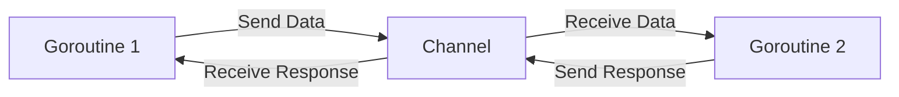

# Understanding Channels in Go — A Better Way to Communicate Between Goroutines ↔️
As we saw in the [Exploring Goroutines](../1-exploring-goroutines/README.md) post that channels are a way to **communicate between goroutines**, in this post we will explore `channels` in more detail.

## What is a `Channel`? 
- **Goroutines** work independently and do their own thing, but sometimes we need to **communicate** between them. This is where **channels** are used.
- Think of it like blocks in memory that we can **put data** into and **take data** out of.
- By default, `channels` work like a handshake between goroutines:
	- When you **send data** to a channel, the goroutine waits until another goroutine is ready to receive it
	- When you try to **receive data** from an empty channel, the goroutine waits until another goroutine sends something
- This **blocking behavior** ensures that data is sent and received in a **synchronized** way.
- The **communication** is **bidirectional** by default, meaning that we can send and receive values from the same channel.



## When Should You Use `Channels`? 🤔
Before diving into `channels`, it's important to understand when you actually need them. Not every program needs concurrency, and adding channels and goroutines can make your code more complex.

Use `channels` when
- You have tasks that can run independently and in parallel (like processing multiple files).
- A producer creating data and a consumer processing it at different speeds (e.g a web server handling requests).
- Multiple workers that need to share results or coordinate their work (e.g. a web crawler).
- Long-running operations where you want to avoid blocking the main program.

Most programs start simple. Concurrency can be introduced when you have a clear need for it, like improving performance or handling multiple tasks simultaneously.

## Operations on `Channels`: ⚒️
**Creating a channel**: 
- A `channel` is created using the **make()** function. While creating a channel, we need to **specify the type of data** and the **capacity** of the channel. If we don't specify the capacity, it will be 0 capacity channel, which is called an **unbuffered** channel.
	```go
	unbuffered := make(chan string) // Unbuffered channel
	```

    ```go
	buffered := make(chan int, 5) // Buffered channel with capacity 5
	```

**Sending data to a channel**: 
- The `<-` operator is used to **send data** to a `channel`. It means "send this data to the channel".
	```go
	ch <- "Data"
	```

**Receiving data from a channel**: 
- The `<-` operator is also used to **receive data** from a `channel`, but in the opposite direction. It means "receive data from the channel".
	```go
	data := <-ch
	```
> Both sending and receiving are **blocking operations** by default.

**Checking if a channel is closed**:
- While receiving data from a `channel`, it also returns a second boolean value 'ok' to indicate if the channel is closed or not.
	```go
	data, ok := <-ch
	if !ok {
		fmt.Println("Channel is closed")
	}
	```
 
**Closing a channel**: 
- This is done using the `close()` function. Closing a channel indicates that no more data will be sent on it. It's very important to close channels to avoid memory leaks and also to signal the receiver that no more data will be sent.
	```go
	close(ch)
	```

## Example
Add an array of integers using a goroutine and send the result back through a channel.

```go
package main

import "fmt"

func main() {
	// Create an unbuffered channel for integers
	c := make(chan int)

	nums := []int{1, 2, 3, 4, 5, 6, 7, 8, 9, 10}

	// Start a goroutine to calculate the sum
	go func() {
		defer close(c) // Close channel after sending the result
		sum := 0
		for i := 0; i < len(nums); i++ {
			fmt.Println("Adding:", nums[i])
			sum += nums[i]
		}
		c <- sum
	}()

	output := <-c
	fmt.Println("Sum:", output)
}

```

### Explanation of the code: 📝
1. Create a `channel` using the **make()** function and specify the type of data to be sent through the channel
2. Use **defer** to ensure the channel is closed when done
3. Define an array of integers to sum
4. Start a **goroutine** to calculate the sum of the integers
5. Use a for loop to iterate through the array and add each integer to the sum
6. Send the result back to the main function through the `channel`
7. In the main function, receive the result from the channel (this is a blocking operation, so the main function will wait until the channel is closed or data is received from the channel)
8. Print the sum of the integers

## Types of `Channels`: 🎢
### Unbuffered Channels: 
- **What they are**: `Channels` with **zero capacity** that can't store any data.
- **How they work**: The sender must wait until someone is ready to receive, and the receiver must wait until someone sends. Both goroutines have to be present at the same time.
- **When to use them**: Unbuffered channels are used when you want to ensure that data is sent and received in a **synchronized** manner.
- **Watch out for**: If one goroutine tries to send but no one is listening, or tries to receive but no one is sending, the program will fall into a deadlock.
- Simply unbuffered channels are like a **mediator between goroutines** that don't have any capacity to hold data.

### Buffered Channels: 
- **What they are**: `Channels` with a **fixed capacity** that can store multiple items.
- **How they work**: Senders can keep sending data (until the buffer fills up). Receivers can pick up data when they're ready (until the buffer empties).
- **When to use them**: Ideal when one goroutine produces data faster than another can consume it - the buffer acts as a temporary holding area to store data until it's ready to be consumed.
- **Watch out for**: Deadlocks can still happen when the buffer is completely full (sender waits) or completely empty (receiver waits) and no other goroutine is there to send or receive data.
- Buffered channels will behave like an unbuffered channel if the buffer is full.

### Example of an Unbuffered channel:
Example I:
> This is an example where we hit a deadlock because the main goroutine is blocked on the receive operation, and the goroutine that sends data is blocked on the send operation. They are waiting for each other, which leads to a deadlock.

```go
package main
import "fmt"

func main() {
	ch := make(chan string) 

	ch <- "Data" 
	fmt.Println(<-ch) 
}
```

Output:
```
fatal error: all goroutines are asleep - deadlock!
```

Example II:
> Here we don't hit a deadlock because the main goroutine is not blocked on the receive operation, and the goroutine that sends data is not blocked on the send operation. Simply, they are not waiting for each other but working concurrently.

```go
package main

import (
	"fmt"
)

func main() {
	ch := make(chan string)

	// Start a goroutine to send data
	go func() {
		ch <- "Data"
	}()

	message := <-ch
	fmt.Println(message)
}

```

### Example of a Buffered channel:
```go
package main
import "fmt"

func main() {
	ch := make(chan string, 3) 

    // Send data to the channel
	ch <- "Data" 
	ch <- "Data" 
	ch <- "Data" 

	// Receive data from the channel
	fmt.Println(<-ch)
	fmt.Println(<-ch) 
	fmt.Println(<-ch)
}
```

Output:
```
Data
Data
Data
```

## Channel directions: 🔄
Channels can be **directional**, meaning they can be used for sending only or receiving only. All this time we have been using channels that are **bidirectional**, i.e. both sending and receiving data.

Using send only or receive only channels makes our code more type-safe and clear about the intent of the channel.

### Example
```go
package main

import (
    "fmt"
    "time" 
)

func sender(ch chan<- string) {
    ch <- "Data from sender"
	defer close(ch)
}

func receiver(ch <-chan string) {
    msg := <-ch
    fmt.Println("Received:", msg)
}

func main() {
    ch := make(chan string) 

    // Start goroutines for sending and receiving
    go sender(ch)   
    go receiver(ch) 

    time.Sleep(100 * time.Millisecond) 
    fmt.Println("Main function completed")
}
```

### Explanation of the code: 📝
1. Create a channel using the `make()` function and specify the type of data to be sent through the channel
2. Start two goroutines to send and receive data
3. The `sender` function can only send data to the channel, and the `receiver` function can only receive data from the channel. This enforces type safety and makes the intent of the channel clear.

4. Since we are not using WaitGroup here, we need to give some time for goroutines to complete before the main function exits
5. Main function completed

## Using `select` with channels ⚖️
- The select statement is used to wait on multiple channel operations. It allows a goroutine to wait on multiple communication operations, and it will proceed with the first one that is ready.
- This is useful when you have multiple channels and you want to perform operations on whichever channel is ready first.
- The select statement is similar to a switch statement, but for channels. It allows you to handle multiple channel operations in a non-blocking way.

### Syntax of `select` statement:
```
select {
    case value := <-channel1:
        // Executes if channel1 has data to receive
    case channel2 <- value:
        // Executes if channel2 is ready to receive data
    case <-time.After(1 * time.Second):
        // Executes if no other case is ready within 1 second (timeout)
    default:
        // Executes immediately if no other case is ready
}
```

### Example of using `select` with channels:
> In this example we have two channels ch1 and ch2. ch1 sends data after 2 seconds, while ch2 sends data after 1 second.

> The select statement waits for either channel to be ready and prints the message accordingly. Since ch2 is ready first, it prints that message first, followed by ch1.

```go
package main

import (
	"fmt"
	"time"
)

func main() {
	ch1 := make(chan string)
	ch2 := make(chan string)

	// Goroutine that sends after 2 seconds
	go func() {
		time.Sleep(2 * time.Second)
		ch1 <- "Takes 2 seconds to send this message"
	}()

	// Goroutine that sends after 1 second
	go func() {
		time.Sleep(1 * time.Second)
		ch2 <- "Takes 1 second to send this message"
	}()

	// Use select to handle multiple channels
	for i := 0; i < 2; i++ {
		select {
		case msg1 := <-ch1:
			fmt.Println("Received from ch1:", msg1)
		case msg2 := <-ch2:
			fmt.Println("Received from ch2:", msg2)
		case <-time.After(3 * time.Second):
			fmt.Println("Timeout: No message received within 3 seconds")
		}
	}
}
```
Output:
```
Received from ch2: Takes 1 second to send this message
Received from ch1: Takes 2 seconds to send this message
```

## Common Pitfalls: 💥
### Deadlocks
- A deadlock occurs when two or more goroutines are waiting for each other to release resources, resulting in a situation where none of the goroutines can make progress.
- Causes
	- Sending to an unbuffered channel with no receiver
	- All goroutines are blocked waiting for channels
	- Circular dependencies between channels

### Goroutine Leaks
- Goroutine leaks occur when a goroutine is not properly cleaned up after it's done executing, leading to memory leaks and potential resource exhaustion.
- Causes
	- Goroutines waiting on channels that never receive data
	- Infinite loops without exit conditions
	- Not properly closing channels

## TL;DR:
- `Channels` are unique to Go and are used for **communication** between **goroutines**.
- There's a saying in Go, **"Don't communicate by sharing memory; instead, share memory by communicating"**, which is true for channels.
- Having a good understanding of `channels`, different types of channels, their operations, and common patterns of using channels will come very handy to write more efficient and safer concurrent programs in Go.
- **Unbuffered channels** do not store data and are used for synchronous communication—both sender and receiver must be ready.
- **Buffered channels** can hold a limited number of values, allowing the sender and receiver to work at different speeds without always waiting for each other.
- Always **close** channels once you're done sending values to avoid memory leaks and signal completion to other goroutines.
- Declare `channel directions` (chan<-, <-chan) in function parameters to enforce clearer intent and type safety.
- Be aware of common pitfalls like deadlocks, goroutine leaks, and panic scenarios when using channels.
