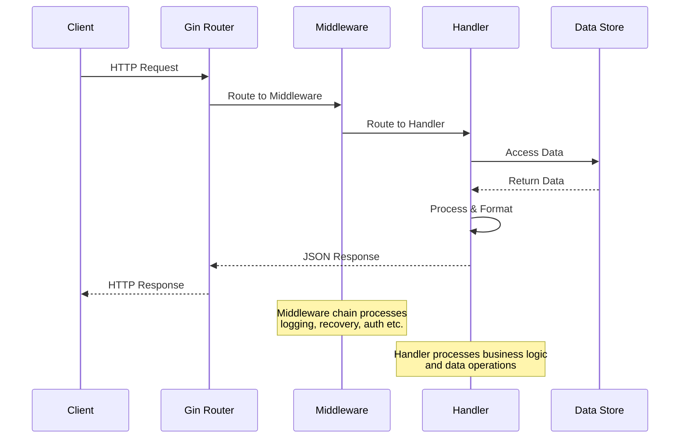

# Building a RESTful API with Go and Gin ⚡️
##### Gin, not the one you're thinking of!
Gin is a popular **Go framework** that’s fast and efficient—making it a great choice for building **scalable web applications**. It's simple and easy to use, making the code not look magic but rather straightforward.

## About `Gin` 🍸
`Gin` is a **lightweight**, **high-performance** web framework built on Go's standard net/http package. Here’s why Gin stands out:
- **Speed & Simplicity**: Gin has blazing-fast performance since it's built on top of the standard Go HTTP server and has minimal overhead. 
- **Routing**: It provides a powerful routing system that handles complex URLs, path parameters effortlessly.
- **Middleware**: It allows you to plug in middleware for logging, authentication, rate limiting etc, with seamless integration in your app.
- **JSON**: It supports JSON parsing and generation out of the box, making it easy to work with JSON data. JSON is quite a common pattern in RESTful APIs and Gin provides convenient ways to handle it.
- **Scalability & Concurrency**: It leverages Go's concurrency model (goroutines) to handle concurrent requests efficiently and scale applications horizontally to manage heavy load on the server.

## Specific to Gin~
- **`gin.Default()`**: Creates a new Gin router with default middleware (logging and recovery). The recovery middleware catches panics and returns a 500 error, ensuring your server stays running.
- **`context.BindJSON(&struct)`**: Binds incoming JSON request bodies to a Go struct, with automatic validation and error handling.
- **`context.Param(key)`**: Retrieves path parameters (e.g. :id in /todos/:id).
- **`context.Query(key)`**: Extracts query parameters from the URL (e.g., ?query=example).
- **`router.Run(address)`**: Starts the HTTP server on the specified address (e.g., localhost:8080).
- **`router.[HTTPMethod](path, handler)`**: Defines a route for a specific HTTP method and path. For example, router.GET("/todos", getTodos).

## Creating HTTP Server using Gin 🚀
 
### 1. Setup project <br/>
We’ll build a RESTful API to manage a todo list stored in memory. The API will support the following endpoints:
- **GET /todos**: Retrieve all todos, with optional filtering by query or status.
- **POST /todos**: Create a new todo
- **GET /todos/:id**: Retrieve a specific todo by its ID
- **PATCH /todos/:id**:  Toggles the completed status of a todo
- **DELETE /todos/:id**: Delete a specific todo by its ID

Let's dive in!

Before writing code, ensure you have Go installed on your system. 
Create a new directory for your project, initialize a Go module, and install the Gin package. 

```bash
mkdir todo-api
cd todo-api
go mod init todo-api
go get github.com/gin-gonic/gin
```
> This sets up a Go module named todo-api and installs the Gin framework.

### 2. Getting Gin up and running
Let’s start with a minimal Gin server to test the setup. Create a file named main.go:

```go
package main

import (
    "github.com/gin-gonic/gin"
    "net/http"
)

func main() {
    router := gin.Default()
    router.GET("/todos", func(c *gin.Context) {
        c.IndentedJSON(http.StatusOK, gin.H{"message": "Hello, World!"})
    })
    router.Run("localhost:8080")
}
```

Run the server using the following command:

```bash
go run main.go
```

Open your browser and navigate to http://localhost:8080/todos. You should see the following output:

```json
{
"message": "Hello, World!"
}
```
> This confirms that Gin is set up correctly. The `gin.Default()` function initializes the router with logging and recovery middleware, and router.Run starts the server.

### 3. Define the Todo Model and In-Memory Store

```go
package main

import (
    "errors"
    "net/http"
    "strings"
    "github.com/gin-gonic/gin"
)

// Todo represents a todo item
type Todo struct {
    ID        string `json:"id"`
    Item      string `json:"item"`
    Completed bool   `json:"completed"`
}

// In-memory store for todos
var TODOS = []Todo{
    {ID: "1", Item: "Learn Go", Completed: false},
    {ID: "2", Item: "Build an API", Completed: false},
}
```
> The Todo struct uses JSON tags to map fields to JSON keys.

### 4. Helper Functions
1. Case-insensitive string search: This function checks if a substr is present in the  str, ignoring case.
```go
func containsIgnoreCase(str, substr string) bool {
    return strings.Contains(strings.ToLower(str), strings.ToLower(substr))
}
```

2. Retrieve a todo by ID: This function searches the TODOS slice for a todo with the given ID.
```go
func getTodoById(id string) (*Todo, error) {
    for i := range TODOS {
        if TODOS[i].ID == id {
            return &TODOS[i], nil
        }
    }
    return nil, errors.New("todo not found")
}
```

### 5. Writing the API Endpoints
#### 5.1 GET /todos

This endpoint retrieves all todos, with optional filtering by a query (search term) or status (completed or not).

```go
func getTodos(context *gin.Context) {
    query := context.Query("query")
    status := context.Query("status")

    var filtered []Todo

    for _, todo := range TODOS {
        // Match query if provided
        if query != "" && !containsIgnoreCase(todo.Item, query) {
            continue
        }

        // Match status if provided
        if status == "true" && !todo.Completed {
            continue
        }
        if status == "false" && todo.Completed {
            continue
        }

        filtered = append(filtered, todo)
    }

    context.IndentedJSON(http.StatusOK, filtered)
}
```

#### 5.2 GET /todos/:id
This endpoint retrieves a specific todo by its ID.
```go
func getTodo(context *gin.Context) {
    id := context.Param("id")
    todo, err := getTodoById(id)

    if err != nil {
        context.IndentedJSON(http.StatusNotFound, gin.H{"message": "Todo not found"})
        return
    }

    context.IndentedJSON(http.StatusOK, todo)
}
```

#### 5.3 POST /todos
This endpoint creates a new todo in the in-memory list.
```go
func addTodo(context *gin.Context) {
    var newTodo Todo

    if err := context.BindJSON(&newTodo); err != nil {
        context.IndentedJSON(http.StatusBadRequest, gin.H{"error": err.Error()})
        return
    }


    TODOS = append(TODOS, newTodo)

    context.IndentedJSON(http.StatusCreated, newTodo)
}
```

Test with curl
```bash
curl -X POST http://localhost:8080/todos -H "Content-Type: application/json" -d '{"id":"3","item":"Test API","completed":false}'
```

#### To check the **Update** and **Delete** endpoints, you can refer to the [complete code](./main.go) for this example.

## Request Handling - Behind the Scenes 🎬


## TL;DR:
- Gin is a **popular web framework** for Go that provides a simple and efficient way to build web applications.
- It is built on top of the **standard Go HTTP server** and provides a powerful routing system that handles complex URLs, path parameters effortlessly.
- It provides a robust **middleware** system that allows to easily build features like logging, authentication, rate limiting into the request-response cycle.
- Gin supports **JSON parsing** and generation out of the box, making it easy to work with JSON data. JSON is quite common pattern in RESTful APIs and Gin provides convenient ways to handle it.
- It leverages Go's concurrency model (goroutines) to handle concurrent requests efficiently and scale applications horizontally to manage high traffic loads.
- The example provided demonstrates how to create a **simple RESTful API using Gin** to manage a list of todos in memory, with endpoints for retrieving, adding, updating, and deleting todos.
- Learn more about Gin from the [Documentation](https://gin-gonic.com/en/docs/).
